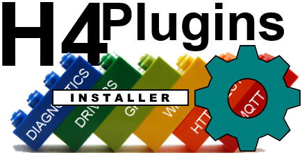

# "1-click" Library ecosystem installer and command-line utility for H4, H4Plugins and dependent libraries

**STATUS: EXPERIMENTAL v0.0.3**

## KNOWN ISSUES:

Github limits unauthentiated accesses to 60/hour, after that it gives you an "rate limited" error. The script makes about 12 or 13 calls when installing h4plugins, meaning that if 5 usages *worldwide* happen at the same time, the last will get a "rate limt" erro. No solution yet but to wait an hour and try again.

I'm working on a better fix

### CHANGELOG:

#### v0.0.2 29/06/2021

Added ``ESPAsyncUDP`` for ESP8266 builds of ``h4plugins`` 

# ***MAC OS/linux users: the code has been written to be OS-neutral and thus *should* work for you, however I do not have a Mac to test it on, so all volunteers, please form an orderly queue...***

---

## If you are able, please [Support me on Patreon](https://patreon.com/esparto) and/or subscribe to my [Youtube channel (instructional videos)](https://www.youtube.com/channel/UCYi-Ko76_3p9hBUtleZRY6g)

---

# Contents

* [Overview/features](#overview)
* [Installation](#installation)
* [Running the installer](#running-the-installer)
* [Command-line utility](#command-line-utility)
* [Issues](#issues)

---

# Overview

Watch the video! [Running the h4installer](https://youtu.be/Q1givForuEQ)

Installing the (up to) 9 libraries and further tools required by H4Plugins can be tedious, especially if you compile for both ESP32 and ESP8266. The ``h4installer`` reduces this process to  a "1-click" action which automatically installs all of the required libraries, their dependencies ( if they are older than the current master branch on [github](https://www.github.com/philbowles))  and the relevant ArduinoIDE tools.

## Features:
* Downloads, unzips and installs any library in the dependency chain whose version is less than the latest public master
* Where a library requires async TCP support, downloads either (or both) of:
  * [Forked AsyncTCP](https://github.com/philbowles/AsyncTCP) (if user has ESP32 core boards installed)
  * [Forked ESPAsyncTCP](https://github.com/philbowles/ESPAsyncTCP) (if user has ESP8266 core boards installed)
* Where a library is dependent upon [Forked ESPAsyncWebserver](https://github.com/philbowles/ESPAsyncWebServer), downloads either (or both) of:
  *  [ESP32 sketch data uploader](https://github.com/me-no-dev/arduino-esp32fs-plugin) (if user has ESP32 core boards installed)
  * [LittleFS upload tool](https://github.com/earlephilhower/arduino-esp8266littlefs-plugin) (if user has ESP8266 core boards installed)
* Installs the [ESP Exception Decoder](https://github.com/me-no-dev/EspExceptionDecoder) (required when submitting issues on any crash)
* Installs advanced optimised board definitions and special memory model for ITEAD SONOFF devices
* If h4plugins is installed, additionally installs (Currently on Windows systems only):
  * Windows desktop UI integration to control H4 devices
* Provides flexible command-line control of H4 devcies (all OS)
    

## The "menagerie" roadmap is now (almost) history

Exisitng users should already be familiar with the "menagerie" and its installation roadmap

### The related / dependent libraries

|| Name | Provides | Notes |
| :---: | :----------  | :--- | :--- |
||[Forked AsyncTCP](https://github.com/philbowles/AsyncTCP)|"Glue" to LwIP (ESP32)| Important bugfixes |
||[Forked ESPAsyncTCP](https://github.com/philbowles/ESPAsyncTCP)|"Glue" to LwIP(ESP8266)| Missing features added |
||[Forked ESPAsyncWebserver](https://github.com/philbowles/ESPAsyncWebServer)| Basis of webUI in H4Plugins| Several major bugfixes |
||[PMB Tools](https://github.com/philbowles/pmbtools)|'32/'8266 HAL and utility functions| |
||[AardvarkTCP](https://github.com/philbowles/AardvarkTCP)|Simple Large-payload Async TCP| API-compatible with ESPAsyncTCP, seamless TLS/SSL |
||[PangolinMQTT](https://github.com/philbowles/PangolinMQTT)|Async MQTT Client|QoS 0/1/2 Fully 3.1.1 compliant. Large payloads |
||[ArmadilloHTTP](https://github.com/philbowles/ArmadilloHTTP)|Async HTTP/S Client| Simple send/callback of large payloads |
||[H4](https://github.com/philbowles/H4)|Scheduler/Async Timers| |
||[H4/Plugins](https://github.com/philbowles/h4plugins)|Full Async IOT Firmware| Webserver, MQTT, OTA, NTP, HTTP etc etc |

---

If you imagine a starting point on the roadmap, then the installer will work backwards from there to the start, installing every out-of-date library it finds on the route, making allowances for whether you have the ESP32 and/or ESP8266 core(s) installed. It also updates the ArduinoIDE tools relevant to the chosen library and installed core(s).

When you run it, it asks for that starting point library and once finished, the enitre environment is "ready to rock". It truly is a 1-click solution.

---

# Installation

1. ``h4installer`` requires [Python 3](https://www.python.org/downloads/). Download and install from [here](https://www.python.org/downloads/) making sure you start with the "customised install" option and then tick the box to "Add Python to environment variables"

2. Download and [unzip this repo](https://github.com/philbowles/h4installer/archive/refs/heads/master.zip). Take care when choosing a location to unzip to as this location must be permananent: files within the repo are referenced by the command-line utility (amongst others). The author, for example, has it installed in `C:\Users\phil\Documents\h4installer`

---

# Running the installer

This will depend on which OS you use:

* Windows: double-click `install.bat` you will be prompted for the starting library (see important note below)
* Others: enter command `py install_h4plugins.py < starting library >` e.g. `py install_h4plugins.py PangolinMQTT`

That's all there is to it! The following libaries / tools will be installed depending on the chosen starting library

## ***Important note for Windows users installing h4plugins***

The installer updates the registry with the Windows desktop UI extensions, which require administrator access. You must start `install.bat` using: right click / Run as Administrator

On success, you should see something resembling this:

On Windows, you will then see this "context" (right click) menu in the network explorer for all your H4 devices:

---

# Command-line utility

[H4 Installer](https://github.com/philbowles/h4installer) also adds a utility that can be run from anywhere to control your H4 devices (this is what the Network Explorer context menu handler uses [ shown above ])

---

# Issues

## If you want a *quick* resolution, please follow these rules:

1. As with all H4 and H4Plugins libraries, please make sure you have read *all* the relevant documentation relating to the issue and watched any videos on the [Youtube channel (instructional videos)](https://www.youtube.com/channel/UCYi-Ko76_3p9hBUtleZRY6g). Please also subscribe to the channel for notifications of news and updates.

2. If you still think there is a problem, then join the [Facebook H4  Support / Discussion](https://www.facebook.com/groups/444344099599131/) group and report the issue briefly there. This is because I visit the group every day, whereas I do not have time to visit 11 github repos every day. Furthermore, it alerts other users to potential problems and allows an initial assessment. 

3. If there is a genuine issue then you will be referred to [Raising H4/H4Plugins issues](https://github.com/philbowles/h4plugins/blob/master/docs/issues.md) after which you are advised to create a full github issue report.

4. Failing to make an initial report in the [Facebook H4  Support / Discussion](https://www.facebook.com/groups/444344099599131/) group and simply starting with a github issue, or failing to include all of the information required in [Raising H4/H4Plugins issues](https://github.com/philbowles/h4plugins/blob/master/docs/issues.md) is likely to result in a ***long*** delay before it gets picked up.

---

(c) 2021 Phil Bowles h4plugins@gmail.com

* [Support me on Patreon](https://patreon.com/esparto)
* [Youtube channel (instructional videos)](https://www.youtube.com/channel/UCYi-Ko76_3p9hBUtleZRY6g)
* [Facebook H4  Support / Discussion](https://www.facebook.com/groups/444344099599131/)
* [Facebook General ESP8266 / ESP32](https://www.facebook.com/groups/2125820374390340/)
* [Facebook ESP8266 Programming Questions](https://www.facebook.com/groups/esp8266questions/)
* [Facebook ESP Developers (moderator)](https://www.facebook.com/groups/ESP8266/)
